# OneRec ACLGraph 与多轮流水优化记录（初稿）

## 1. 背景与目标

### 1.1 推荐推理与传统大模型推理的区别

两者都可以使用 Transformer，但服务目标和输出对象不同：传统大模型生成“文本”，推荐模型生成“候选 item”。

| 对比项 | 传统大模型推理 | 推荐推理 |
| --- | --- | --- |
| 典型任务 | 对话、问答、摘要、代码生成 | 召回候选、粗排、推荐序列生成 |
| 输入 | Prompt / 对话上下文 | 用户行为、场景、候选 item、业务特征 |
| 输出 | 文本 token，直到 EOS 或长度上限 | item ID、候选序列、分数或概率 |
| 生成方式 | 通常一条序列逐 token 生成 | 同时生成多条候选，常用 Beam Search |
| 形状特点 | 输出长度、停止位置变化较大 | batch、beam width、候选宽度相对固定 |
| 主要指标 | TTFT、TPOT、生成质量 | QPS、端到端延迟、召回覆盖率、排序效果 |
| 关键流水 | prefill -> token decode | 特征/序列编码 -> 候选生成 -> 筛选/粗排 -> 下游精排 |

直观地说：传统 LLM 主要关心“下一个文字 token 什么时候生成”；推荐推理主要关心“这一批候选 item 能否快速生成并交给后续排序”。因此推荐推理除了 prefill 和 decode，还要重点处理批量候选、Beam Search 以及 Host/Device 之间的候选交接。

### 1.2 OneRec 在推荐链路中的职责

本次分析的 OneRec 位于推荐链路的**召回/粗排阶段**，负责把用户和场景信息转换成一批“值得继续处理”的候选 item。它不负责最终精排，也不直接决定展示结果。

| 推荐阶段 | 主要工作 | OneRec 是否负责 |
| --- | --- | --- |
| 召回 | 从大规模 item 库中找出相关候选，控制候选覆盖率 | 是，生成候选 item/token 序列 |
| 粗排 | 用较轻量模型或初步分数压缩候选集合 | 是，利用 logits、Beam Search 结果做初步筛选 |
| 精排 | 综合更多特征，对较小候选集精确打分 | 否，属于下游模块 |
| 业务处理 | 过滤、去重、库存/策略约束、最终展示 | 否，属于下游模块 |

OneRec 在本链路中的数据流可以概括为：

```text
用户行为/上下文特征
    -> OneRec Encoder：编码用户与场景信息
    -> OneRec Decoder + Beam Search：生成多条候选 item/token 序列
    -> 召回/粗排候选集
    -> 下游精排、过滤、业务决策
```

| OneRec 阶段 | 做什么 | 产生/消费的关键数据 |
| --- | --- | --- |
| Encoder forward | 编码用户行为、场景和其他输入特征 | encoder output |
| Decoder prefill | 结合 encoder 信息，计算首轮候选分布 | logits、Cross-KV |
| Sampler / Beam Search | 从候选分布中选出多条候选并扩展序列 | beam token、sequence group |
| Decoder decode rounds | 逐轮生成后续候选 token | stable token buffer、round scalar |
| 输出到下游 | 将候选 item/序列和分数交给粗排/精排 | 候选集、概率/分数 |

在 OneRec xAttention 中，encoder output 会作为 decoder CrossAttention 的 K/V；decoder 首轮 prefill 产生 logits，随后通过固定轮数的 decode 和 Beam Search 扩展候选。因此，本次优化关注的是 Cross-KV 传递、prefill 到 decode 的衔接，以及 decode round 之间 beam token 的 Device 侧复用；不改变推荐策略，也不改变调度 round 数量。

### 1.3 OneRec Encoder/Decoder 模型结构

下图只描述模型结构：Encoder - Decoder。Sampler、模型外的Beam Search 和候选后处理；图中只展开一个 Decoder Block，实际会按层重复。

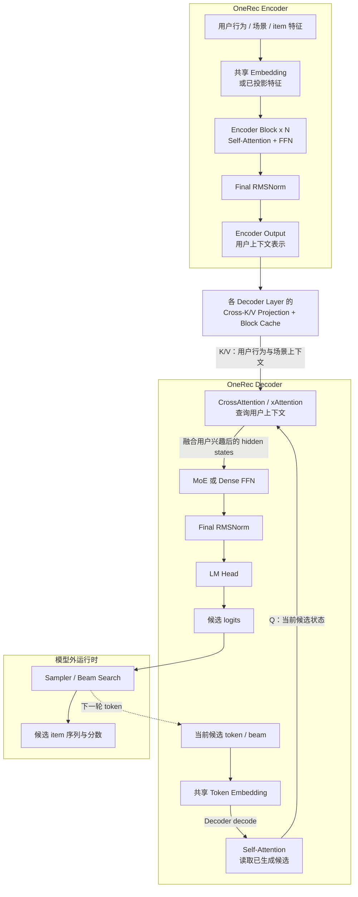

#### BeamSearch原理与Xattention相关kv拆分设计(不在此轮优化范围内所不做过多涉及)
Beam Search 的多轮候选扩展：


Xattention Shared/Unshared KV 拆分


#### CrossAttention 在做什么

Self-Attention 回答“当前已经生成了什么”，CrossAttention 回答“这些候选与当前用户是否相关”。两者的数据来源不同：

| 输入 | 来自哪里 | 表示什么 | 生命周期 |
| --- | --- | --- | --- |
| Query（Q） | Decoder Self-Attention 输出 | 当前候选 token/beam 的生成状态 | 每个 decode round 更新 |
| Key（K） | Encoder output 经每层 K projection | 用户行为和场景中可被检索的特征 | prefill 生成并写入 Cross-KV cache |
| Value（V） | Encoder output 经每层 V projection | 与命中用户兴趣对应的上下文内容 | 后续 decode rounds 直接复用 |

CrossAttention 使用当前候选的 Q 对 Encoder K 做相关性匹配，再按匹配权重聚合 V。输出不是最终 item，而是“已经注入用户上下文”的 decoder hidden states，随后经过 MoE/Dense FFN、LM Head，才得到下一批候选 item/token 的 logits。

```text
当前候选状态 Q
    + 用户上下文 K/V
    -> 计算候选与用户兴趣的相关性
    -> 聚合相关用户上下文
    -> 生成更符合当前用户的候选 logits
```

对本轮优化而言，关键点是 **K/V 在首轮 prefill 投影并写入 Cross-KV block cache，后续 decode 只读复用**。因此不需要每个 round 重算 Encoder 或重新构造 Cross-KV；框架只需稳定维护 `cross_attn_block_tables`、实际 KV 长度和首次写入 slots。

#### 结构要点

| 模块 | 简要结构 | 在推理中的作用 |
| --- | --- | --- |
| Encoder | 共享 Embedding + 多层 Encoder Block + Final RMSNorm | 将用户行为和场景特征编码为上下文表示 |
| Decoder | 共享 Embedding + Self-Attention + CrossAttention + MoE/Dense FFN + Final RMSNorm | 同时结合已生成 token 和用户上下文，生成候选 hidden states |
| LM Head | Decoder hidden states 到候选词表/item 空间的投影 | 输出每个候选 token/item 的 logits |
| Sampler / Beam Search | 模型外搜索逻辑 | 根据 logits 选择候选，并将选中 token 送入下一轮 decode |

OneRec xAttention 一次请求通常包含 encoder/prefill、首轮采样以及固定轮数的 beam decode。优化前，Host 需要为每一阶段准备 tensor、分配或清零中间缓存，并逐算子下发模型计算。只要 Host 为了生成下一阶段输入读取 Device 结果，或者显式同步 stream，后续的 CPU 准备、H2D 和 kernel launch 就会整体串在 Device 计算之后，形成流水空泡。

本文设计的优化基于以下四个 PR commit：

- [`0f616287`](https://github.com/jd-opensource/xllm/commit/0f616287dbfc8e4c72a0e1442b91f7c55bd350d5)：OneRec 缓存、多流和 ACLGraph 基础能力。
- [`7fa83f6d`](https://github.com/jd-opensource/xllm/commit/7fa83f6d763969c7868699836bfa9436542ae28d)：OneRec Graph 隔离、固定形状和 capture 同步修复。
- [`80965c39`](https://github.com/jd-opensource/xllm/commit/80965c393eeedfd3acab45fba2215c76e16e96ba)：多轮 decode replay 和 Device token buffer 直连。
- [`30f2ad12`](https://github.com/jd-opensource/xllm/commit/30f2ad1231a0c012b05252966ba6444e7f9e78e6)：MoE W8A8 Dynamic 接入。

#### 优化目标及结果：
输入3~140 输出3 beam_width=256

  优化前性能：A3单卡(2die) P99时延65ms 15 req / s

  优化目标：  A3单卡(2die) P99时延65ms 38 req / s

  优化结果：  A3单卡(2die) P99时延65ms 80 req / s 

## 2 优化分析

### 2.1 优化方向一：op_summarry分析 - 模型组图优化
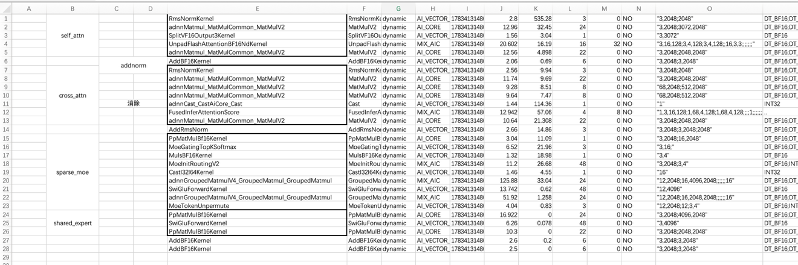

算子分析
  可融合算子：addnorm

  可消除算子：用于插入reshape的castNode

  可优化：moe权重量化, moe NZ 权重

  可并行：权重预取/共享专家双流 （单卡部署，不考虑eplv2；模型双流，预取/专家双流无收益）

### 2.2. 优化方向二：ACLGraph 与 CrossAttention 块缓存改造
decoder - prefill (调度空泡大头)
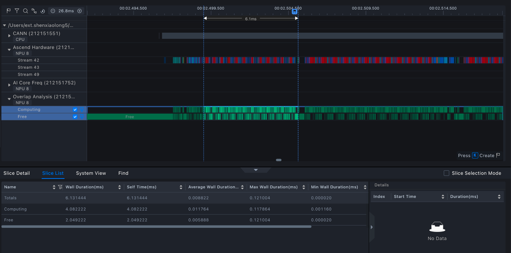
decoder - decode
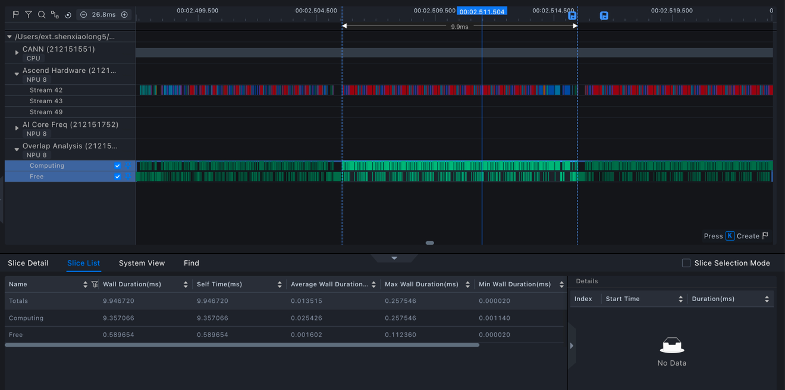

#### 2.2.1 为什么通用 KV 元数据不适合 OneRec xAttention

OneRec CrossAttention 的 K/V 来自 encoder output。decode token 不会继续扩展 Cross-KV，因此调度器没有必要按“prompt + 最大生成长度”分配这部分缓存。

`0f616287` 将调度契约改为：

```text
Cross-KV block 数量 = ceil(encoder_seq_len / block_size)
```

#### 2.2.2 Batch Builder 生成 CrossAttention 专用元数据

框架为每个 sequence 构造：

| Tensor | 作用 | 生命周期 |
| --- | --- | --- |
| `cross_attn_kv_cu_seq_lens` | 每个请求真实 encoder KV 长度 | prefill/decode 复用 |
| `cross_attn_block_tables` | 逻辑请求到物理 Cross-KV block 的映射 | 请求全生命周期 |
| `cross_attn_new_cache_slots` | 首次 prefill 写入 K/V 的物理 slot | 仅首次 prefill |

首次 prefill 的 slots 按 batch 内最大 block span 补齐，padding 值使用 `-1`。ReshapeAndCache 跳过 `-1` slot，因此 padding K/V 不会覆盖有效缓存。

进入 decode 后：

- 清空 `cross_attn_new_cache_slots`，不重复写 Cross-KV。
- 将 block table 补齐或裁剪到 `max_position_embeddings / block_size`，让不同 encoder 长度获得稳定的 decode 图输入 shape。
- xAttention decode 不再构造动态 positions 和 attention mask，CrossAttention 直接消费 Device 侧稳定地址的 actual length 和 block table。

##### 创建与消费对比

```cpp
// 优化前：沿用通用 KV cache 的 prompt + decode span
auto slots = seq->kv_state().kv_cache_slots(n_kv_cache_tokens, total_seq_len);
input.input_params.new_cache_slots = torch::tensor(slots, torch::kInt);
// 通用 attention 消费 block_tables/new_cache_slots
```

```cpp
// 优化后：只生成 encoder KV 的 Cross-KV metadata
cross_kv_lens_vec.emplace_back(seq->encoder_seq_len());
auto slots = seq->kv_state().kv_cache_slots(0, seq->encoder_seq_len());
xattn.cross_attn_block_tables = create_2d_tensor(block_tables, torch::kInt);
xattn.cross_attn_new_cache_slots = torch::tensor(slots, torch::kInt);
node.variantPack.inTensors.at(idx) =
    AtTensor2Tensor(xattn.cross_attn_block_tables);
```

decode 阶段将 `cross_attn_new_cache_slots` 置空，只保留固定列数的 block table 和实际长度；因此不会在每个 round 重建或重写 Cross-KV。

#### 2.2.3 CrossAttention 图内数据流 与 算子需求

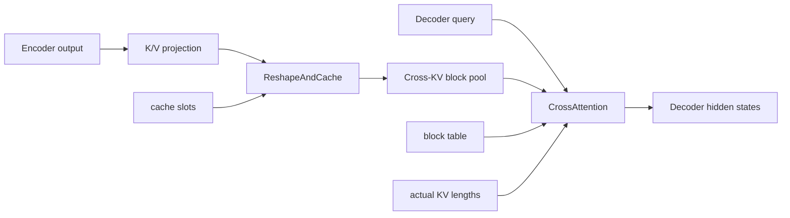

首次 prefill 完成 K/V projection 并写 block pool；后续 decode 只读取 block pool。Cross-KV 不经过 Host，也不在 prefill/decode 边界重新绑定。

但原 FIA 路径存在 HostData 数据输入（seqlen），无法在graph_replay时保证稳定地址计算；

OneRec 又必须支持分页 Cross-KV 的 block table 和实际长度；

因此需要一版支持 q/k/v/block_table/seqlen 全 Device metadata 的专用 CrossAttention 算子。
同时，Q/K/V 来源不对称、Cross-KV 只在 prefill 写入、decode 不使用 causal mask，这些是专用算子在接口设计上进一步收敛的原因。

### 2.3. 优化方向三：双 pipeline 的 stream 核心资源上限

注意到双流上的模型实例执行耗时不稳定，严重影响到p99时延，分析注意到双流并行时算子执行的耗时有时有明显的上升

#### 优化前耗时

专家 gateup - swiglu - down 耗时： 225.7us -> 389.7us

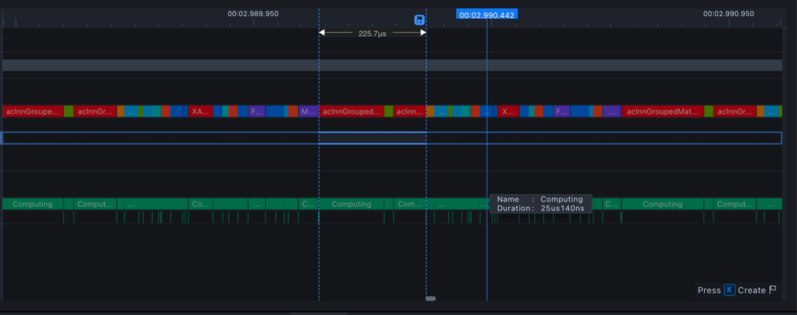

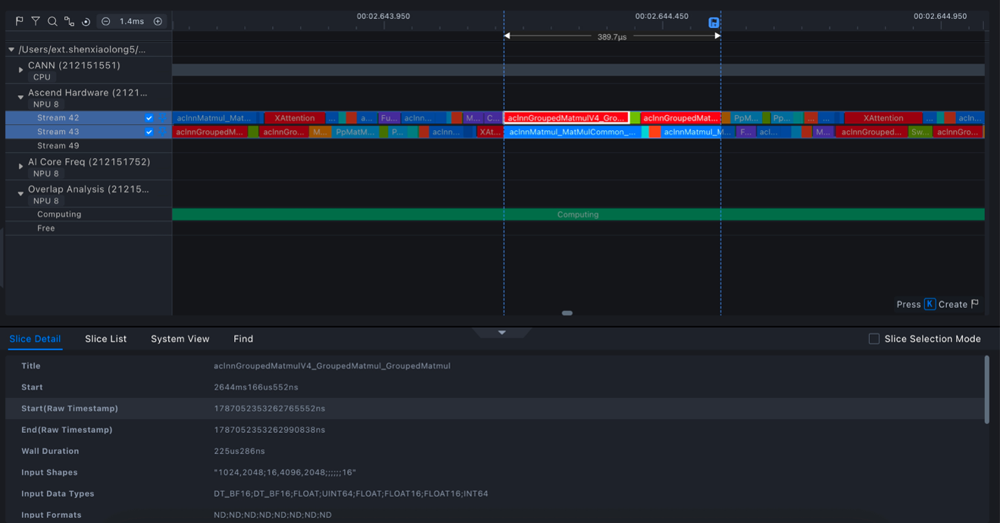

#### 双流分核方案

在`0f616287` 增加了的 pipeline 的 NPU stream 分核能力，这里的“分核”不是把物理核心永久独占地切成两组，而是为每条 stream 配置可使用的 Cube Core 和 Vector Core 数量上限。

生效条件：

```text
enable_onerec_multistream_core_split = true
AND rec_model_kind = OneRec
AND rec_worker_max_concurrency = 2
```

归因上，`0f616287`（PR **#1994**）首次引入双 stream 的单流资源上限：每条 stream 固定使用一半 Cube/Vector Core；`7fa83f6d`（PR **#2010**）只是在此基础上增加 `onerec_multistream_core_ratio`，把固定 50% 改为可配置 ratio，默认值仍为 `0.5`，有效范围为 `(0, 1]`：

```text
cube_limit   = max(1, floor(total_cube_cores   * ratio))
vector_limit = max(1, floor(total_vector_cores * ratio))
```

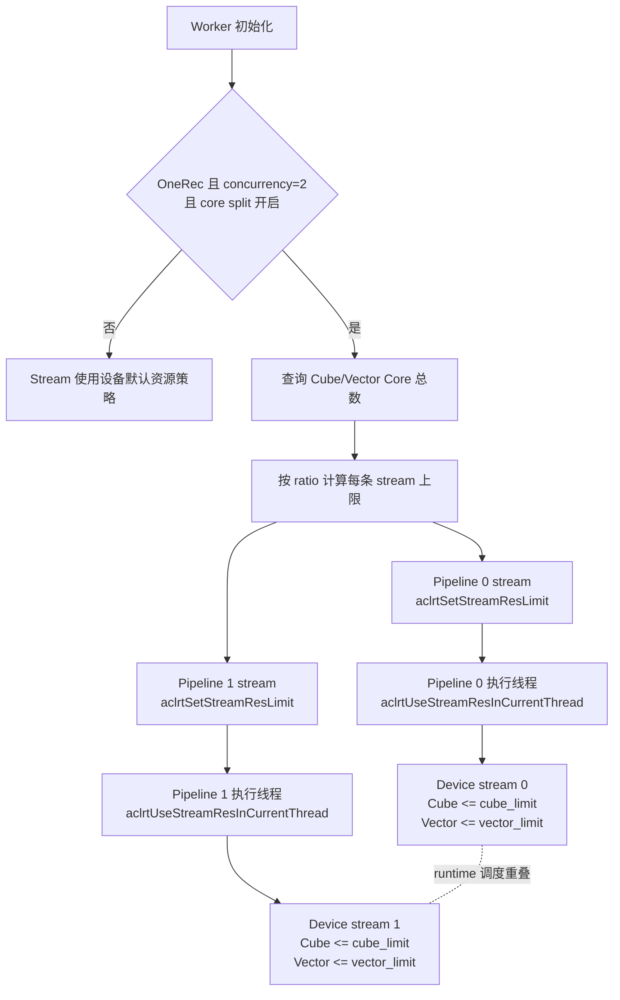

配置分为两个阶段：

1. pipeline 初始化时，对各自从 stream pool 获取的 stream 调用 `aclrtSetStreamResLimit`。
2. `step_async` 的执行线程切换到对应 pipeline stream 后，调用 `aclrtUseStreamResInCurrentThread`，让当前线程后续下发使用该 stream 的资源配置。

为什么需要设置单流资源上限：

- 如果一条 stream 可以占满全部 Cube/Vector Core，第二条 stream 即使已经完成下发，也可能缺少实际执行资源，双流只能做到任务排队，无法形成有效重叠。
- 默认 `ratio=0.5` 为两条 pipeline 各自留下约一半资源，使两个请求的计算更容易同时推进。
- ratio 过小会降低单 pipeline 峰值性能；ratio 大于 `0.5` 时两条 stream 的上限总和可能超过设备总核心数，runtime 会竞争调度，不等价于物理超配。

这两个 ACL runtime 接口用于资源查询、配置和线程上下文绑定，代码中没有伴随 `aclrtSynchronizeStream` 或整卡同步。因此分核本身不建立跨 stream 依赖，也不是流水同步点。真正可能串行双 pipeline 的仍是 prepare/model-forward Host mutex，以及 ACLGraph capture/replay 的设备级 bookkeeping 锁。分核开关本身不会自动关闭前两把 Host mutex；要释放双 pipeline 的并发下发，还需要启用 multistream performance mode 或分别关闭对应序列化开关。

#### 优化后耗时：

专家 gateup - swiglu - down 耗时： 224.9us -> 257.6us

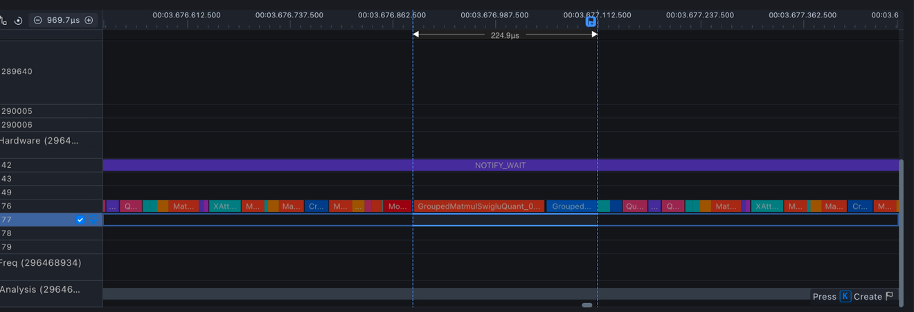

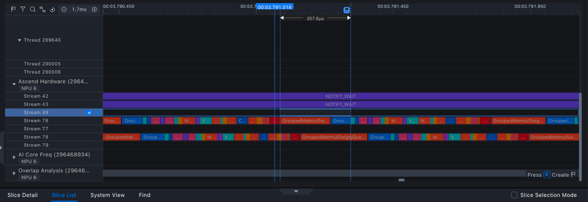

### 2.4. 优化方向四：缓存中间 Tensor，减少 Worker 内部 step 下发间隙

#### 优化前后流水对比：
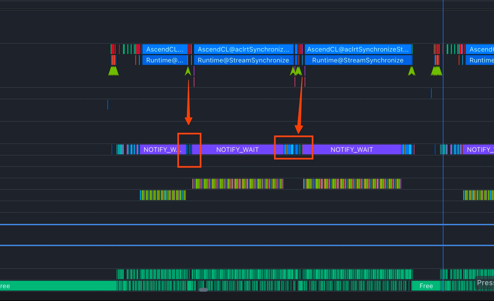
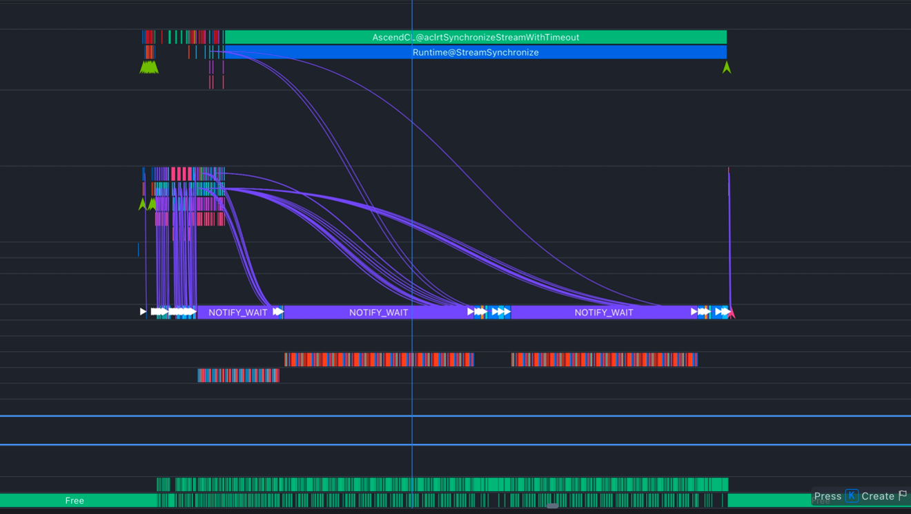

#### 2.4.1 shared/unshared KV workspace 常驻 Device

优化前每个请求按实际 token 数创建每层 shared K/V。优化后 Worker 初始化时按 `max_tokens_per_batch` 为每层预分配：

```text
cached_shared_[k/v]_caches[layer]
    shape = [max_tokens_per_batch, local_kv_heads, head_dim]
```

请求执行时只 slice 出本轮视图并清零，不重新分配底层 storage。unshared K/V 同样由 pipeline 长期持有。

这么做的原因不只是减少 allocator 开销。ACLGraph 会记录 Device 地址，若同一 shape 的请求每次获得不同 storage，Graph 要么读到旧地址，要么必须按地址重新建 key/capture。pipeline-owned cache 将“shape 稳定”提升为“shape + address 稳定”。

##### 创建与消费对比

```cpp
// 优化前：每次 prepare 按本轮 token 数创建新 storage
onerec_params.shared_k_caches.emplace_back(
    torch::zeros({shared_kv_tokens, local_kv_heads, head_dim}, options));
node.variantPack.inTensors.at(idx++) =
    AtTensor2Tensor(onerec_params.shared_k_caches[layer_id]);
```

```cpp
// 优化后：pipeline 初始化一次，prepare 只切 view 并清零内容
cached_shared_k_caches_[layer] = torch::zeros(
    {max_tokens_per_batch_, local_kv_heads, head_dim}, options);
auto shared_k = cached_shared_k_caches_[layer].slice(0, 0, shared_kv_tokens);
onerec_params.shared_k_caches.emplace_back(std::move(shared_k));
node.variantPack.inTensors.at(idx++) =
    AtTensor2Tensor(onerec_params.shared_k_caches[layer_id]);
```

`unshared_k/v` 在旧实现中已经有 pipeline cache；本轮重点是把 shared cache 也提升为固定容量，并让两类 cache 都以稳定地址进入 Graph key 和 block layer。

#### 2.4.2 固定 scalar 和 encoder mask

- `beam_width_tensor` 和 `current_round_tensor` 由 pipeline 创建一次，后续只 `fill_` 更新内容。
- encoder attention mask 使用容量为 4 的缓存，key 包含长度、head 数、dtype、device 和位置编码配置。
- 模型重新加载权重时清空 mask cache，避免旧配置 tensor 被复用。

`beam_width` 和 `current_round` 的创建/消费对比：

```cpp
// 优化前：每次 prepare 创建新的 Device tensor
onerec_params.beam_width_tensor = torch::tensor({beam_width}, int_options);
onerec_params.current_round_tensor =
    torch::tensor({get_onerec_decode_round(onerec_params)}, int_options);
```

```cpp
// 优化后：pipeline 生命周期内只创建一次，后续只改值
if (!beam_width_tensor_.defined()) {
  beam_width_tensor_ = torch::empty({1}, int_options);
}
if (!current_round_tensor_.defined()) {
  current_round_tensor_ = torch::empty({1}, int_options);
}
beam_width_tensor_.fill_(beam_width);
current_round_tensor_.fill_(round);
onerec_params.beam_width_tensor = beam_width_tensor_;
onerec_params.current_round_tensor = current_round_tensor_;
node.variantPack.inTensors.at(idx++) = AtTensor2Tensor(beam_width_tensor_);
node.variantPack.inTensors.at(idx++) = AtTensor2Tensor(current_round_tensor_);
```

#### 2.4.3 Beam Search 输出直连下一轮 Graph

`80965c39` 按 `num_seq = batch_size * beam_width` 缓存 decode token buffer：

这里的 round 内 decode 异步下发归属于 `80965c39`（PR **#2056**）：它把 Beam Search 的输出直接作为下一轮 Graph 输入，删除 `sequence_group.select(...).contiguous()`、positions H2D 和 Graph 私有 token staging，使同一 pipeline stream 通过 FIFO 继续提交下一轮。

```text
cached_decode_token_ids[num_seq] -> Tensor[num_seq, 1]
```

Beam Search 直接把 `out_token_ids` 写入该 buffer；下一轮 Graph capture/replay 直接绑定同一地址：

```text
round N graph
    -> sampler
    -> beam_search(out_token_ids = stable_buffer)
    -> fill current_round
    -> round N+1 graph(input_ids = stable_buffer)
```

这条链位于同一 NPU stream。producer/consumer 顺序由 FIFO 保证，不需要 `synchronizeStream` 或额外 event。

##### 创建与消费对比

```cpp
// 优化前：每轮从 sequence_group 重组 token，再复制到 Graph 私有输入
auto tokens = sequence_group.select(2, round - 1).contiguous();
copy_tensor(tokens, persistent_tokens_);
tokens_for_capture_ = persistent_tokens_;
```

```cpp
// 优化后：Beam Search 写 pipeline-owned buffer，下一轮直接消费同一地址
auto& token_ids = cached_decode_token_ids_[num_seq];
if (!token_ids.defined()) {
  token_ids = torch::empty({num_seq, 1}, int_options);
}
beam_tensors.out_token_ids = token_ids;
mutable_input.token_ids = token_ids.reshape({-1});
capture_stable_tensor(mutable_input.token_ids, captured_decode_tokens_,
                     "decode tokens");
tokens_for_capture_ = captured_decode_tokens_;
```

`current_round_tensor` 也采用同样的 create-once/fill-only 方式；因此 round handoff 只更新 Device 内容，不触发 Host 重组、H2D 或私有 staging copy。

与旧实现相比，删除了：

- 从 `sequence_group` 逐轮 `select(...).contiguous()` 生成 token 的 D2D copy。
- Host 构造 positions vector 后创建 Device tensor 的 H2D。
- Graph executor 把 token 再复制到 private persistent tensor 的 staging copy。
- 每轮重复更新 request-static 的 beam width。

#### 2.4.4 最终输出不能复用内部 buffer

异步下发返回不代表 Device 已停止访问 tensor。稳定 token buffer 属于 pipeline，下一请求可能立即覆盖它。因此最后一轮在输出宽度等于 beam width 时写入独立 tensor，再交给输出链路，避免 `ForwardOutput` 与 pipeline cache alias。

这体现了两个不同的生命周期：

| Tensor | 生命周期 |
| --- | --- |
| graph input/workspace | pipeline 生命周期，地址必须稳定 |
| request 最终输出 | 至少存活到上层消费完成，不得被下一请求覆盖 |

### 2.5. 优化方向五：MoE W8A8 Dynamic 接入

`30f2ad12` 不改变 scheduler、batch builder 或 Host/Device step 编排。它在相同 Graph 调度框架中补齐 routed/shared expert 的 W8A8 能力：

- routed expert 的 gate/up 和 down 使用 INT8 weight，router 保持浮点。
- 启用动态 activation quant 和 GMM-SwiGLU quant 路径。
- 支持 fused `weight1/weight2` 以及拆分的 gate/up/down checkpoint。
- 在加载阶段完成 weight transpose、format cast 和 scale 归一化。
- 对 weight dtype、shape、expert 数和 scale 完整性做 fail-fast 校验。

权重预处理发生在模型加载阶段，不进入 steady-state 下发关键路径。运行时仍然是相同的 Graph capture/replay；变化集中在图内 MoE 节点和权重带宽。

#### 2.6. 优化方向六：TASK_QUEUE 双流下发队列

分析加入前述优化后profiling

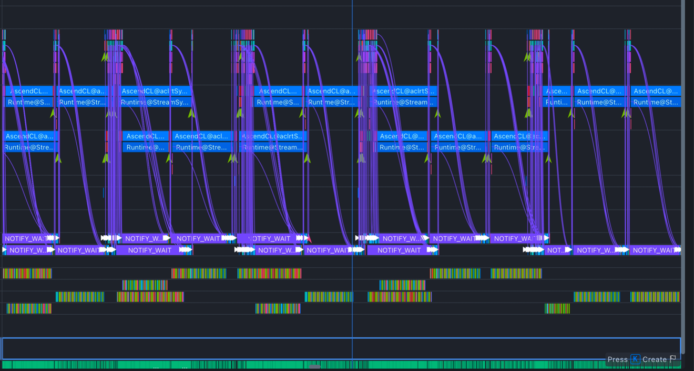

发现非graph部分(libtorch单算子)的计算下发偶尔还是会有相互阻塞的现象，理论上我们希望在不同流的计算下发可以异步起来不用相互阻塞。

结合pytorch相关文档：

https://github.com/Ascend/pytorch/blob/master/docs/zh/api/environment_variable/op_execution/TASK_QUEUE_ENABLE.md

https://github.com/Ascend/pytorch/blob/master/docs/zh/api/environment_variable/op_execution/PER_STREAM_QUEUE.md

配置
```bash
export TASK_QUEUE_ENABLE=1
export PER_STREAM_QUEUE=1
```
开启一个stream一个task_queue算子下发队列。

优化后profiling：

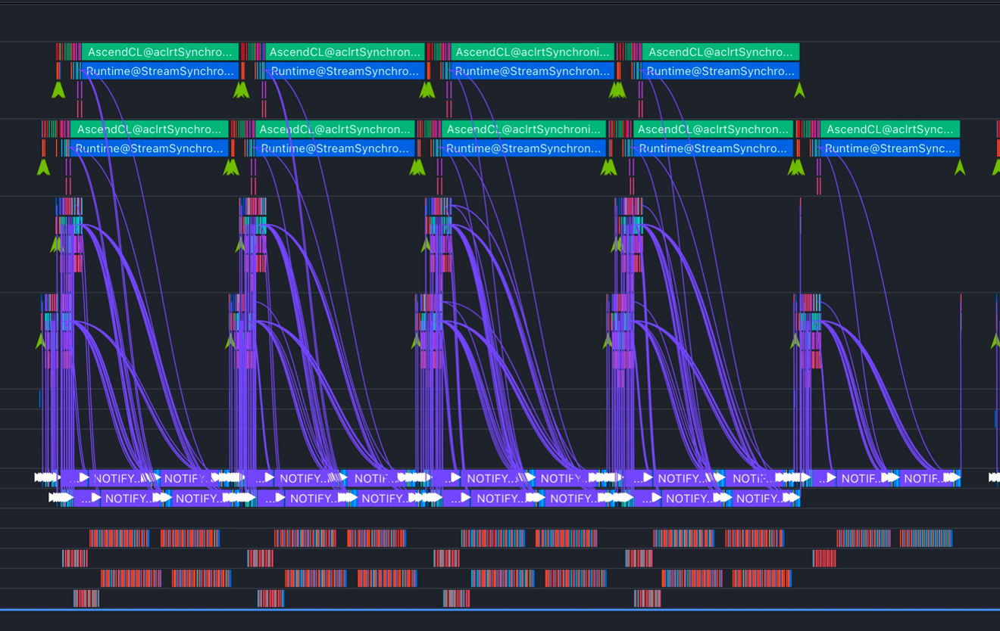

## 3. 优化前后的流水

### 3.1. 优化前：每一轮都让 Host 参与

旧版本的链路大致是：

```text
Host 创建 batch / 元数据
  -> H2D 输入
  -> Encoder eager
  -> Decoder prefill eager（逐算子提交）
  -> Sampler + Beam Search
  -> 取出 token，重排 sequence_group
  -> Host 构造 positions，再 H2D （引入同步）
  -> Decoder decode eager
  -> Sampler + Beam Search
  -> 重复上面的准备，直到第 3 轮
```

这里的“轮间同步”不一定表现为每轮显式 `synchronizeStream()`。动态 allocation、阻塞式 H2D、Host 读取 Device 数值、地址变化导致的重新 capture，都会让下一轮提交被迫等待。真正的问题是 producer/consumer 之间没有稳定的 Device 侧契约。

### 3.2. 优化后的完整链路

优化后的链路可以画成：

```text
首次请求（Graph miss）
  Host: 构造一次 batch 和 Cross-KV 元数据
  Device: Encoder eager
  Device: capture Decoder prefill Graph
  Device: K/V projection -> Cross-KV block cache
  Device: Sampler/Beam Search -> token_buffer[8, 1]

后续 decode round（Graph hit）
  Device: current_round.fill_(1)
  Device: replay decode Graph，直接读 token_buffer[8, 1]
  Device: Beam Search 写回同一个 token buffer
  Device: current_round.fill_(2)
  Device: replay decode Graph
  Device: Beam Search 写回同一个 token buffer
```

prefill、Sampler、Beam Search 和下一轮 decode 都提交到同一 pipeline stream。只要没有跨 stream 的 producer/consumer，FIFO 就已经表达了依赖，不需要在 round 边界插入整卡同步。

## Ps. 同 stream FIFO 是 step 间无同步的基础

prefill、sampler、beam search 和 decode replay 都提交到同一 pipeline stream：

```text
prefill graph
  -> sampler
  -> beam token write
  -> current_round fill
  -> decode graph replay
```

后一个节点天然等待前一个节点在同一 stream 中完成。只有以下情况才需要 event 或同步：

- producer 和 consumer 位于不同 stream。
- Host 必须读取 Device 数值才能决定 shape、分支或请求状态。
- tensor storage 即将被 allocator 或下一请求复用。
- 请求结束时上层要求 CPU 结果已经 ready。

本轮优化通过“Device 状态驻留 + 固定 shape + 固定地址”避免前三类条件落入 steady-state round 边界。

## 4. 四个 commit 的职责边界

| Commit | 框架 tensor 调度 | Graph/同步 | 模型计算 |
| --- | --- | --- | --- |
| `0f616287` | Cross-KV 按 encoder 分配；shared K/V、scalar 缓存；encoder mask 缓存 | 建立 OneRec lazy capture/replay；首次引入双流单流资源上限（固定 50%） | CrossAttention 块缓存路径；模型图节点精简由依赖升级带入 |
| `7fa83f6d` | slots/block table padding；decode 去动态 positions/mask | OneRec Graph 隔离；锁覆盖完整 capture 同步；图 key 收敛；分核比例改为可配置 | 无主要数值语义变化 |
| `80965c39` | stable decode token buffer；Beam 输出直连下一轮；最终输出解耦 | replay 直接绑定 pipeline tensor 地址；同一 pipeline 的 decode round 异步交接 | MoE down weight format 使用具名常量，无调度影响 |
| `30f2ad12` | 无变化 | 沿用现有 capture/replay | MoE W8A8 Dynamic 与 shared expert 量化 |

## 5. 小结

本轮优化不是单纯把 OneRec forward 放进 ACLGraph，而是同步修改 Graph 的 tensor 契约和框架调度方式：

- Scheduler 只为真实的 encoder Cross-KV 分配 block。
- Batch Builder 把真实长度、物理 block 映射和首次写 slot 显式拆分。
- Worker 预分配 Graph 所需中间 tensor，保持 shape 和地址稳定。
- Beam Search 直接生产下一轮 Graph 输入，prefill/decode 和 decode round 之间使用同 stream FIFO，不读取 Device 数值、不插入同步。
- Graph miss 的整卡/stream 同步被限制在冷路径，并通过设备锁保证双 pipeline capture 正确。
- W8A8 在不改变上述调度链路的前提下替换 MoE 图内执行方式。

核心原则与 MTP 异步设计一致：CPU 侧同步读取尽量消除，无法消除的等待移到请求边界；Device 中间状态不回 Host；同 stream 依赖使用 FIFO；固定形状和 tensor 生命周期共同保证 Graph 可复用。
